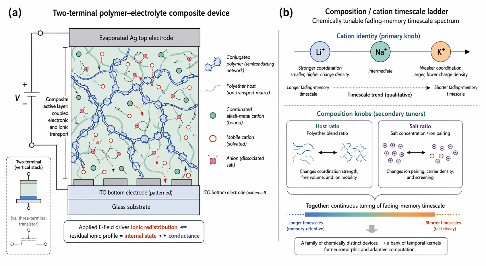
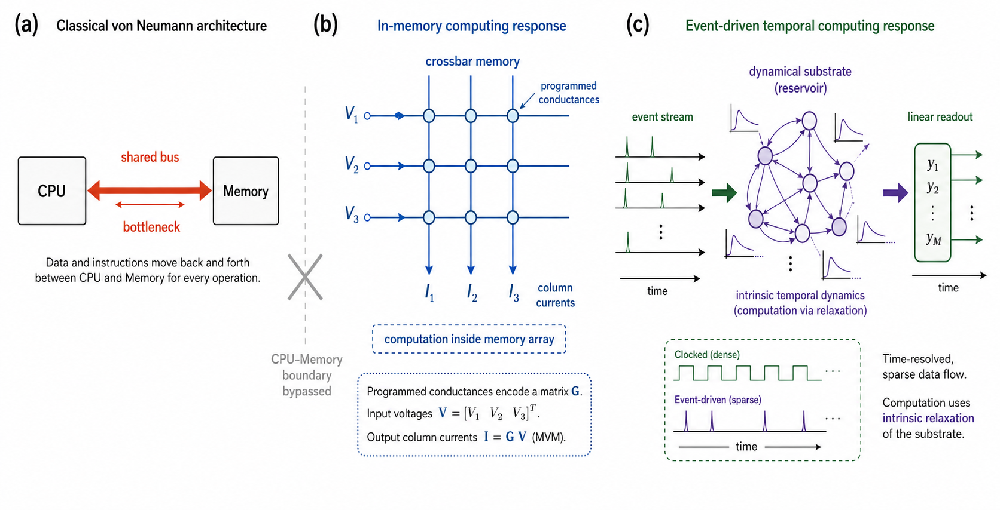
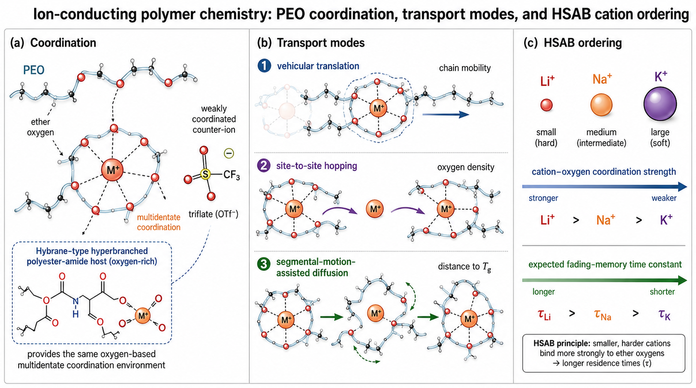

<!-- markdownlint-disable-file MD013 -->

# Polymer-Electrolyte Organic Memristors for Temporal Computing

PhD thesis repository of **Carlos David Prado-Socorro** at the Institute of Molecular Science (ICMol), Universitat de Valencia.

[Read the current thesis draft](exports/thesis.pdf) | [Introduction](exports/chapter1_introduction.pdf) | [Proof-of-concept chapter](exports/chapter2_proof_of_concept.pdf) | [Comparative chapter](exports/chapter3_comparative.pdf)

## Thesis In Brief

This thesis studies solution-processed organic memristive devices whose electrical response is shaped by mobile ions inside a polymer composite. These devices do not merely store a static resistance value: their conductance carries a decaying record of recent electrical activity.

The central idea is to use that **fading memory** as a computational resource. The current experimental result is strongest for polymer-electrolyte **composition**: in the replicated `PEO/LiOTf` grid, composition tunes the switching window, pulse integration, and fading-memory time. Host, anion, and cation chemistry are retained as an illustrative, sample-limited tuning landscape rather than as a powered `Li > Na > K` law.

<p align="center">
  
</p>

The active layer combines a semiconducting conjugated polymer, an oxygen-rich ion-transport host, and a dissolved salt. An applied electric field redistributes the ions. The residual ionic profile changes the device conductance and acts as its internal memory state.

## Why This Matters

Conventional computers repeatedly move data between memory and processing units. For data-intensive workloads, this transfer can cost more energy and time than the computation itself. Memristive hardware offers two complementary routes around that bottleneck:

1. **In-memory computing**, where programmed conductances perform operations inside a memory array.
2. **Event-driven temporal computing**, where the natural relaxation of a physical device processes time-dependent signals.

This thesis focuses on the second route. A device that gradually forgets is not treated as a failed non-volatile memory. Its relaxation time becomes a useful feature for processing streams, spikes, transients, and other time-resolved signals.

<p align="center">
  
</p>

## Research Finding

The working physical hypothesis was that memory timescale is linked to ion transport inside the polymer electrolyte. Ether oxygens in the host coordinate alkali-metal cations, so cation identity was expected to change the relaxation dynamics:

- `Li+`: stronger coordination and longer fading-memory timescales
- `Na+`: intermediate behaviour
- `K+`: weaker coordination and shorter fading-memory timescales

The current Chapter 3 draft keeps that HSAB argument as qualitative framing, but the archive does **not** support a robust host- and anion-independent `Li > Na > K` ordering. The defensible quantitative result is the composition dependence in the `PEO/LiOTf` grid; chemistry beyond that is explicitly sample-limited.

<p align="center">
  
</p>

## Thesis Roadmap

| Chapter | Focus | Status |
| --- | --- | --- |
| 1. Introduction | Computing bottlenecks, synaptic inspiration, memristors, organic materials, and the polymer-electrolyte strategy | Draft available |
| 2. Proof of concept | A fully characterised `SY/Hybrane/LiOTf` two-terminal device with analogue switching, short- and long-term retention, EPSC-like response, and STDP | Draft available |
| 3. Comparative study | How **composition** (the `PEO/LiOTf` grid) tunes volatile dynamics — switching, potentiation, and fading memory — and how electrolyte **chemistry** shifts them further as sample-limited side evidence | Draft available |
| 4. Temporal computing | Data-driven reservoir simulations from Chapter 3 parameter cards: memory-capacity/NARMA benchmarks, WESAD physiological temporal-context reconstruction, and WESAD affective-computing demonstrations; coincidence detection is cut and filter-bank logic is folded into the reservoir framing | Modelling and figures in progress |
| 5. Conclusions | Contributions, limitations, and future directions | Planned |

The proof-of-concept chapter expands the published work:

> Carlos David Prado-Socorro et al., ["Polymer-Based Composites for Engineering Organic Memristive Devices"](https://doi.org/10.1002/aelm.202101192), *Advanced Electronic Materials* 8, 2101192 (2022).

## Repository Guide

| Path | Contents |
| --- | --- |
| [`thesis.tex`](thesis.tex) | Top-level LaTeX entry point |
| [`chapters/`](chapters) | Standalone chapter sources and shared thesis formatting |
| [`figures/`](figures) | Figures used throughout the thesis |
| [`bibliography/`](bibliography) | Shared BibLaTeX database |
| [`exports/`](exports) | Committed PDF snapshots |
| [`handouts/`](handouts) | Planning documents, outlines, and working notes |
| [`docs/`](docs) | Reference docs about the experimental archive and analysis pipeline (data and code live in the sibling `Nanomem_Devices_Library/`) |

## Build The Thesis

The chapter files compile both independently and as part of the complete thesis. A local LaTeX installation with `latexmk` and `biber` is required.

```sh
make chapter1       # build/chapters/chapter1_introduction.pdf
make chapter2       # build/chapters/chapter2_proof_of_concept.pdf
make thesis         # build/thesis.pdf
make all            # build chapters and thesis
make exports        # refresh committed PDF snapshots
make clean          # remove generated LaTeX artefacts
```

Run these commands from the repository root. Generated LaTeX files are written to `build/` and excluded from version control.
